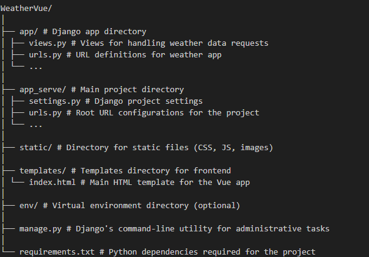

# WeatherApp

## Project Overview
WeatherApp is a web application that provides real-time weather updates. It uses Vue.js for the frontend and Django as the backend server. The app allows users to input a location and receive current weather information, including temperature, pressure, and wind speed.

## Project Structure
Below is an outline of key files and directories within the WeatherVue project:

 


- `app/views.py`: Contains the logic to call weather APIs and serve weather data.
- `app/urls.py`: Includes the URL patterns for the weather endpoints.
- `app_serve/settings.py`: Configures settings for the Django project, including installed apps, middleware, and database.
- `app_serve/urls.py`: The entry point for URL routing; directs the incoming request to the appropriate view based on the URL pattern.
- `static/`: Stores static files like stylesheets, JavaScript files, and images.
- `templates/index.html`: The main page template that Vue.js uses to render the frontend.

## Installation

```bash
# Navigate to the project directory
cd WeatherApp

# Install Python dependencies
pip install -r requirements.txt
```

## Running the Application
You can start the Django development server using the provided batch file. It's a simple one-click solution:

### Run the batch file
start_server.bat

or
```bash
# Run the Django server
python manage.py runserver
```

Open your web browser and navigate to http://localhost:8000 to view the application.

## Features
- Real-time weather updates by location
- Search by city to get current weather information.
- Temperature readings in both Celsius and Fahrenheit
- Wind speed and atmospheric pressure details

## Instructions for use
### Initial interface
 
- Please allow browsers to access your location

- In this way, the weather conditions of the current location can be directly obtained

### Detailed explanation of components


- When the mouse clicks on the magnifying glass icon above, the search bar will expand

- Please enter the city/region you want to search for and use the enter key to search(May require a slight wait)


## Bonus Task
- Ensure the user interface is responsive and works well on different screen sizes.
- Include a search bar for users to enter their desired location for weather forecasts.
- allow users to search for weather forecasts based on their location automatically.